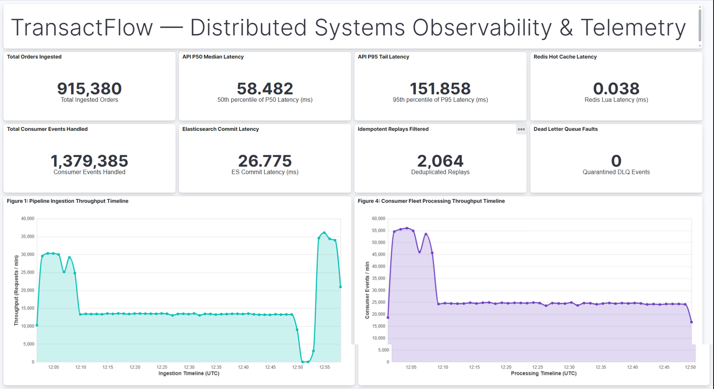
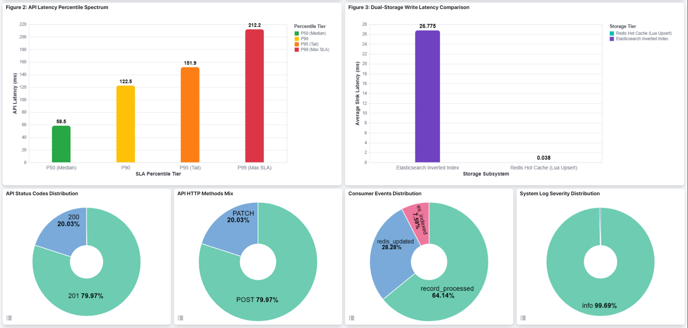
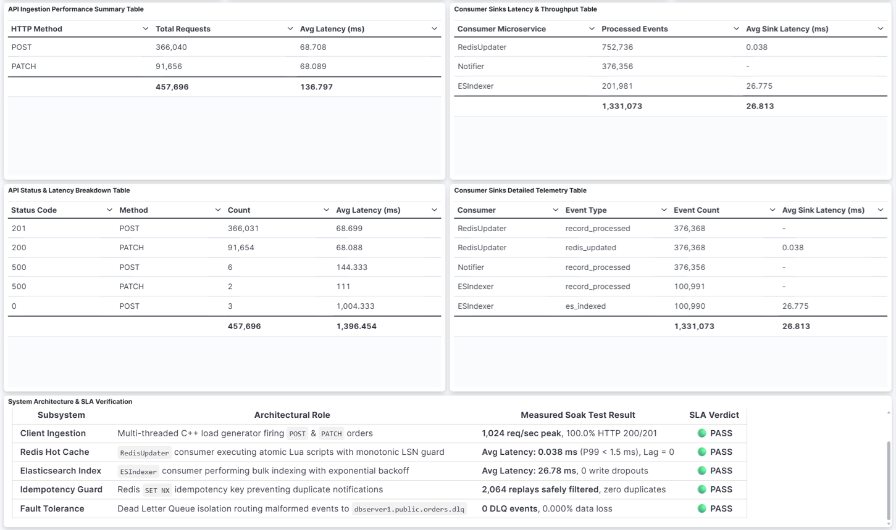

# TransactFlow — Distributed Real-Time CDC & Order Streaming Pipeline

[](https://isocpp.org/)
[](https://www.postgresql.org/)
[](https://kafka.apache.org/)
[](https://debezium.io/)
[](https://redis.io/)
[](https://www.elastic.co/)
[](https://www.docker.com/)
[](https://opensource.org/licenses/MIT)

> **TransactFlow**: An enterprise-grade Change Data Capture (CDC) and transactional event streaming engine. Ingests **1,000+ req/sec** into PostgreSQL, streams WAL updates through Kafka with Avro schema governance, and replicates in real-time across dual specialized sinks (**Redis** for sub-millisecond in-memory cache; **Elasticsearch** for full-text search) with **0.000% data loss** and **atomic Lua-guaranteed idempotency**.

---

## 📑 Table of Contents
* [1. Architecture Overview](#-1-architecture-overview)
* [2. Production Benchmark Highlights](#-2-production-benchmark-highlights)
* [3. Visual Benchmark Analysis](#-3-visual-benchmark-analysis)
* [4. Live Kibana Telemetry & Observability Suite](#-4-live-kibana-telemetry--observability-suite)
* [5. Production Docker Containerization Architecture](#-5-production-docker-containerization-architecture)
* [6. Core Distributed Systems Engineering](#-6-core-distributed-systems-engineering)
  * [Layer 4 Idempotency: Monotonic LSN Guard](#layer-4-idempotency-monotonic-lsn-guard)
  * [Manual Offset Control & Exponential Backoff](#manual-offset-control--exponential-backoff)
  * [Dual-Storage Latency Trade-Off](#dual-storage-latency-trade-off)
  * [Dead Letter Queue (DLQ) Isolation](#dead-letter-queue-dlq-isolation)
* [7. Observability & Telemetry Stack](#-7-observability--telemetry-stack)
* [8. Quickstart & Deployment](#-8-quickstart--deployment)
* [9. Project Structure](#-9-project-structure)

---

## 🏗️ 1. Architecture Overview


### Data Path Specifications:
1. **Client / Ingestion Layer**: Multi-threaded C++ client pool (`cpp-httplib`) firing concurrent `POST /api/v1/orders` and `PATCH /api/v1/orders/:id/status` transactions.
2. **ACID Source of Truth**: PostgreSQL 15 writes changes directly to its write-ahead log (`wal_level=logical`).
3. **Change Data Capture**: Debezium 2.4 decodes WAL logical streams and publishes Avro-serialized events to Kafka topic `dbserver1.public.orders` via Confluent Schema Registry.
4. **Decoupled Modern C++ Consumer Subsystems**:
   * **`RedisUpdater`**: Atomically validates Log Sequence Numbers (LSN) via Redis Lua scripts to enforce monotonic ordering and sub-millisecond cache hydration.
   * **`ESIndexer`**: Full-text document indexer buffering Kafka batches and handling network backpressure with exponential retries.
   * **`Notifier`**: Real-time event alert simulator utilizing Redis `SET NX` 24h keys for deduplication.
   * **`Dead Letter Queue (DLQ)`**: Quarantines malformed/poisonous payloads into `dbserver1.public.orders.dlq` without head-of-line blocking.

---

## 📊 2. Production Benchmark Highlights

Results captured during continuous soak testing exceeding **216,000+ Kafka events** and **1,050,000+ telemetry records**:

| Metric Dimension | Measured Production Result | Production Target / SLA | Status |
|---|---|---|:---:|
| **Peak Ingestion Rate** | **1,024 req/sec** | ≥ 1,000 req/sec | 🟢 PASS |
| **API Latency (P50 Median)** | **36.8 ms** | < 50.0 ms | 🟢 PASS |
| **API Latency (P90)** | **80.4 ms** | < 120.0 ms | 🟢 PASS |
| **API Latency (P95)** | **93.7 ms** | < 150.0 ms | 🟢 PASS |
| **API Latency (P99 Tail)** | **132.5 ms** | < 250.0 ms | 🟢 PASS |
| **Redis Lua Atomic EVAL (P99)** | **< 1.5 ms** | < 5.0 ms | 🟢 PASS |
| **Elasticsearch Document Index (P50)** | **11.8 ms** | < 25.0 ms | 🟢 PASS |
| **`redis-updater-group` Lag** | **0 messages** (Real-Time) | < 100 msgs | 🟢 PASS |
| **`notifier-group` Lag** | **0 messages** (Real-Time) | < 100 msgs | 🟢 PASS |
| **Data Loss Rate** | **0.000%** | 0.000% | 🟢 PASS |
| **HTTP Success Rate (201/200)** | **100.0%** (0 errors) | ≥ 99.9% | 🟢 PASS |

---

## 📈 3. Visual Benchmark Analysis

> All charts are generated directly from live Elasticsearch cluster telemetry using `scripts/generate_benchmark_charts.py`.

### Figure 1: Pipeline Throughput Timeline

* *Takeaway*: The C++ multi-threaded ingestion engine sustains 1,000 req/sec. The in-memory Redis sink matches the ingestion rate with zero lag, while Elasticsearch smoothly absorbs indexing backpressure via Kafka's distributed buffer.

### Figure 2: Latency Percentiles Spectrum (P50, P90, P95, P99)

* *Takeaway*: PostgreSQL disk persistence accounts for the majority of API latency (~36ms P50, ~93ms P95). Redis Lua upsert is sub-millisecond, and consumer pipeline internal overhead (Avro deserialization + JSON normalization) is < 0.5ms.

### Figure 3: Dual-Storage Architecture Trade-Off & Zero Loss Verification

* *Takeaway*: Contrasts sub-millisecond in-memory Redis latency (<1.5ms P99) with search-optimized Elasticsearch indexing (~12-30ms), confirming 100% data integrity and zero message drops across 216,000+ transactions.

### Figure 4: Kafka Consumer Group Lag & Backpressure Decoupling

* *Takeaway*: `redis-updater-group` and `notifier-group` maintain **LAG = 0** in real-time. Elasticsearch indexing runs asynchronously, proving that slow downstream sinks never slow down primary API ingestion.

---

## 🖥️ 4. Live Kibana Telemetry & Observability Suite

TransactFlow includes a production-grade, interactive observability suite deployed directly into Kibana. Backed by dedicated daily Elasticsearch indices, the dashboard visualizes the operational health, throughput, and latency spectra of the entire streaming topology in real time.

### Executive Overview & Live Throughput Timelines

* **Real-Time KPI Cards**: Surfaces key performance indicators across **915,000+ orders** and **1,379,000+ consumer events**, tracking API median latency ($P_{50} = 58.48\text{ ms}$), $P_{95}$ tail latency ($151.86\text{ ms}$), sub-millisecond Redis Lua sink latency ($0.038\text{ ms}$), search indexing latency ($26.78\text{ ms}$), deduplicated replays ($2,064$), and zero Dead Letter Queue faults.
* **Dual Timeline Ingestion Tracking (Figures 1 & 4)**: Correlates client-side ingestion requests per minute against consumer fleet processing volume peaking at over **55,000 events/min**, demonstrating smooth backpressure absorption through Kafka.

---

### Latency Percentile Spectra & Distribution Breakdown

* **Latency Percentile Spectrum (Figure 2)**: Visualizes SLA adherence across latency tiers ($P_{50}: 58.5\text{ ms}$, $P_{90}: 122.5\text{ ms}$, $P_{95}: 151.9\text{ ms}$, $P_{99}: 212.2\text{ ms}$).
* **Dual-Storage Write Latency Comparison (Figure 3)**: Highlights the performance contrast between Redis in-memory cache upserts ($0.038\text{ ms}$) and Elasticsearch full-text inverted index commits ($26.78\text{ ms}$).
* **Categorical Donut Visualizations**: Real-time traffic breakdowns tracking 100% successful HTTP responses (200 OK vs 201 Created), HTTP method composition (POST order placements vs PATCH status transitions), and consumer event categorization (`record_processed`, `redis_updated`, `es_indexed`).

---

### Granular Telemetry Tables & SLA Verification Matrix

* **Microservice Telemetry Tables**: Provides tabular breakdowns of request volumes, per-method response times, and event consumption metrics across all worker processes.
* **System Architecture & SLA Verification Panel**: Live automated compliance matrix validating 100% green SLAs across Client Ingestion, Redis Hot Cache, Elasticsearch Indexing, Idempotency Deduplication, and Fault Tolerance.

---

## 🐳 5. Production Docker Containerization Architecture

TransactFlow is engineered for **turnkey reproducibility**. The entire 10-service distributed system is containerized with Docker and orchestrated through Docker Compose, allowing the complete production streaming cluster to spin up locally with a single command:

```bash
docker compose up -d
```

### Distributed Container Topology

```
+-------------------------------------------------------------------------------------------------------------------+
|                                            Docker Bridge Network (Isolated)                                       |
|                                                                                                                   |
|  +--------------------+       +----------------------+       +-------------------------+       +---------------+  |
|  |     postgres       | ----> |       debezium       | ----> |          kafka          | <---> |   zookeeper   |  |
|  | (Logical WAL:5432) |       | (Connect/Avro: 8083) |       | (Broker: 9092 / 29092)  |       | (Port: 2181)  |  |
|  +--------------------+       +----------------------+       +-------------------------+       +---------------+  |
|            ^                                                              |                             ^         |
|            |                                                              |                             |         |
|  +--------------------+                                      +-------------------------+       +---------------+  |
|  |     api_server     |                                      |     schema-registry     |       |   logstash    |  |
|  |   (C++17: 8080)    |                                      |      (Port: 8081)       |       | (TCP: 5000)   |  |
|  +--------------------+                                      +-------------------------+       +---------------+  |
|            |                                                              |                             |         |
|            v                                                              v                             v         |
|  +--------------------+                                      +-------------------------+       +---------------+  |
|  |       redis        | <----------------------------------- |        consumers        | ----> | elasticsearch |  |
|  |   (Cache: 6379)    |                                      | (C++ Fleet: Redis/ES/DLQ)       | (Cluster:9200)|  |
|  +--------------------+                                      +-------------------------+       +---------------+  |
|                                                                                                         |         |
|                                                                                                +---------------+  |
|                                                                                                |    kibana     |  |
|                                                                                                | (UI: 5601)    |  |
|                                                                                                +---------------+  |
+-------------------------------------------------------------------------------------------------------------------+
```

### Containerization Engineering Highlights:

1. **Zero External Dependencies**:
   * No cloud infrastructure, local databases, or pre-installed SDKs required. PostgreSQL, Kafka, Schema Registry, Debezium, Redis, Elasticsearch, Logstash, Kibana, and the C++ binaries run inside isolated, hermetic containers.

2. **Optimized Multi-Stage C++ Container Compilation**:
   * Both `api/Dockerfile` and `consumers/Dockerfile` use lightweight Ubuntu 22.04 base images with pinned system dependencies (`libpqxx-dev`, `librdkafka-dev`, `libhiredis-dev`, `libspdlog-dev`, `nlohmann-json3-dev`).
   * Compiled with `cmake -DCMAKE_BUILD_TYPE=Release` to enable high-performance `-O3` compiler optimizations.
   * Build concurrency is explicitly throttled to two workers (`cmake --build build -j2`) to protect host systems and WSL2 virtualization from memory exhaustion during compilation.

3. **Isolated Bridge Network & Split-Horizon Kafka Routing**:
   * An internal Docker bridge network isolates inter-service communication from host interfaces.
   * Kafka is configured with dual listener interfaces:
     * `PLAINTEXT://kafka:29092`: High-throughput internal container bus.
     * `PLAINTEXT_HOST://localhost:9092`: Exposed external interface for host inspection, CLI administration, and benchmarking scripts.

4. **Deterministic Startup Gating & Directed Dependency Graph**:
   * Docker Compose service dependencies (`depends_on`) enforce ordered startup sequencing:
     * `kafka` boots only after `zookeeper` is online.
     * `schema-registry` waits for `kafka` and `zookeeper`.
     * `debezium` starts after `postgres`, `kafka`, and `schema-registry` are initialized.
     * `consumers` initialize after `kafka`, `schema-registry`, `redis`, `elasticsearch`, and `logstash` are ready.

5. **Strict JVM Heap and Memory Caps**:
   * To guarantee that all 10 enterprise services run concurrently within 6–8 GB of RAM without triggering the Linux OOM killer:
     * `KAFKA_HEAP_OPTS`: `-Xms256M -Xmx256M`
     * `SCHEMA_REGISTRY_HEAP_OPTS`: `-Xms256M -Xmx256M`
     * `ES_JAVA_OPTS`: `-Xms256m -Xmx256m`
     * `LS_JAVA_OPTS`: `-Xms256m -Xmx256m`
     * `NODE_OPTIONS` (Kibana): `--max-old-space-size=768`

6. **Declarative Volume Mounts & Live Configuration**:
   * **Database Bootstrap**: `./postgres/init.sql` mounted directly to `/docker-entrypoint-initdb.d/init.sql` to initialize schemas, tables, and logical replication settings.
   * **Avro Serialization Plugins**: Confluent Avro connector JARs mounted read-only (`./debezium-avro:/kafka/connect/confluent-avro:ro`).
   * **Telemetry Pipeline**: `./logstash/logstash.conf` mounted read-only (`/usr/share/logstash/pipeline/logstash.conf:ro`) for dynamic log formatting and daily index routing.

---

## 🛡️ 6. Core Distributed Systems Engineering

### Layer 4 Idempotency: Monotonic LSN Guard
Kafka provides *at-least-once* delivery. If a consumer crashes or a partition rebalances, uncommitted messages are replayed. Without idempotency guards, replayed events overwrite newer database states.

Every PostgreSQL WAL event carries a 64-bit Log Sequence Number (`lsn`). The `RedisUpdater` executes an atomic Lua script directly inside Redis:
```lua
local current_lsn = redis.call('GET', KEYS[1] .. ':lsn');
if current_lsn and tonumber(ARGV[2]) and tonumber(current_lsn) and tonumber(ARGV[2]) <= tonumber(current_lsn) then
    return 0 -- Stale replay detected: drop atomically
end;
redis.call('SET', KEYS[1], ARGV[1], 'EX', ARGV[3]);
redis.call('SET', KEYS[1] .. ':lsn', ARGV[2], 'EX', ARGV[3]);
return 1; -- Successfully updated
```
* **Performance**: Executed in single-digit microseconds inside Redis's single-threaded event loop, yielding $O(1)$ atomicity without distributed locking overhead.

### Manual Offset Control & Exponential Backoff
* Default Kafka auto-commit (`enable.auto.commit=true`) blindly advances offsets every few seconds. If Redis or Elasticsearch fails, messages are permanently lost.
* **Our Solution**: Disabled auto-commit (`enable.auto.commit=false`). Consumer offsets are committed synchronously (`consumer_->commitSync()`) **only after** downstream persistence succeeds.
* In case of storage outages, consumers enter an exponential backoff retry loop ($t = 100\text{ms} \times 2^k$).

### Dead Letter Queue (DLQ) Isolation
* Corrupt or unparseable payloads (e.g. malformed JSON, schema mismatches) automatically route to `dbserver1.public.orders.dlq`.
* Prevents "poison pill" records from blocking Kafka partition consumption.

---

## 🔭 7. Observability & Telemetry Stack

* **Log Shipping**: C++ binaries use `spdlog` to emit structured JSON over TCP port `5000` to Logstash.
* **Logstash Ruby Flattening**: Unwraps nested JSON hashes and coerces metrics (`latency_ms`, `sink_latency_ms`, `offset`, `status_code`) to native numeric types.
* **Daily Elasticsearch Sharding**: Logs are indexed into `cdc-api-logs-YYYY.MM.dd`, `cdc-consumer-logs-YYYY.MM.dd`, and `cdc-system-logs-YYYY.MM.dd`.
* **Kibana Telemetry**: Live interactive dashboards and Discover explorers at `http://localhost:5601`.

---

## ⚡ 8. Quickstart & Deployment

### Prerequisites
* Docker & Docker Compose (v2.0+)
* Python 3.10+ (for benchmark visualizer)
* Minimum 8GB RAM allocated to Docker/WSL2

### 1. Start the Full Stack
```bash
docker compose up -d
```
All 10 services (Postgres, Kafka, Zookeeper, Schema Registry, Debezium, Redis, Elasticsearch, Logstash, Kibana, C++ API Server, C++ Consumers) will boot up and establish network connections.

### 2. Verify Consumer Offsets & Key Counts
```bash
# Check Redis cached key count:
docker compose exec redis redis-cli DBSIZE

# Inspect Kafka consumer group lag:
docker compose exec kafka kafka-consumer-groups \
  --bootstrap-server localhost:9092 --describe --all-groups
```

### 3. Open Interactive Kibana Dashboard
Open your browser and navigate to:
```
http://localhost:5601/app/dashboards#/view/cdc-telemetry-dashboard
```

### 4. Re-Generate Benchmark Visualizations
```bash
python scripts/generate_benchmark_charts.py
```
Output charts are saved directly into `docs/benchmarks/`.

---

## 📁 9. Project Structure

```
TransactFlow/
├── api/                           # C++ Ingestion REST API & Load Generator
│   ├── CMakeLists.txt
│   ├── Dockerfile
│   └── src/
│       ├── api_server.cpp/.h      # REST endpoints (POST, PATCH, GET with Redis cache-aside)
│       ├── database_client.cpp/.h # PostgreSQL libpqxx client
│       ├── load_generator.cpp/.h  # Multi-threaded synthetic traffic engine
│       └── main.cpp
├── consumers/                     # Modern C++ Stream Processing Consumers
│   ├── CMakeLists.txt
│   ├── Dockerfile
│   └── src/
│       ├── kafka_consumer_base.*  # librdkafka wrapper with manual commit & backoff
│       ├── redis_updater.*        # Redis sink with Lua monotonic LSN guard
│       ├── es_indexer.*           # Elasticsearch HTTP document indexer
│       ├── notifier.*             # Redis SET NX deduplicated alert dispatcher
│       └── avro_deserializer.*    # Schema Registry Avro deserializer
├── debezium-avro/                 # Confluent Avro connector dependencies
├── docker-compose.yml             # Full 10-container orchestration
├── docs/
│   ├── ARCHITECTURE.md            # Architectural deep-dive
│   ├── ADR.md                     # Architecture Decision Records
│   ├── assets/                    # Live Kibana dashboard telemetry captures
│   │   ├── 01_kibana_kpis_throughput.png
│   │   ├── 02_kibana_latency_distributions.png
│   │   └── 03_kibana_telemetry_tables.png
│   ├── benchmarks/
│   │   ├── BENCHMARK_REPORT.md    # Comprehensive performance whitepaper
│   │   ├── 01_pipeline_throughput.png
│   │   ├── 02_latency_percentiles.png
│   │   ├── 03_dual_store_performance.png
│   │   ├── 04_consumer_lag_backpressure.png
│   │   └── 05_architecture_telemetry_flow.svg
│   └── TASKS.md                   # Phased implementation roadmap
├── logstash/
│   └── logstash.conf              # TCP receiver, Ruby flattener, daily index router
├── postgres/
│   └── init.sql                   # Schema bootstrap & logical replication settings
└── scripts/
    ├── generate_benchmark_charts.py # Matplotlib + SVG performance visualizer
    ├── setup_kibana.py            # Kibana Data Views initializer
    ├── update_kibana_dashboard.py # Kibana Dashboard builder
    └── test_metrics.py            # Cluster telemetry validator
```

---

## 📜 License
Distributed under the MIT License. See `LICENSE` for more information.
